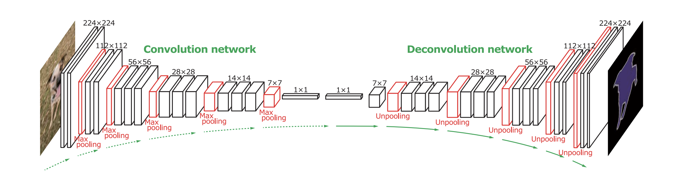
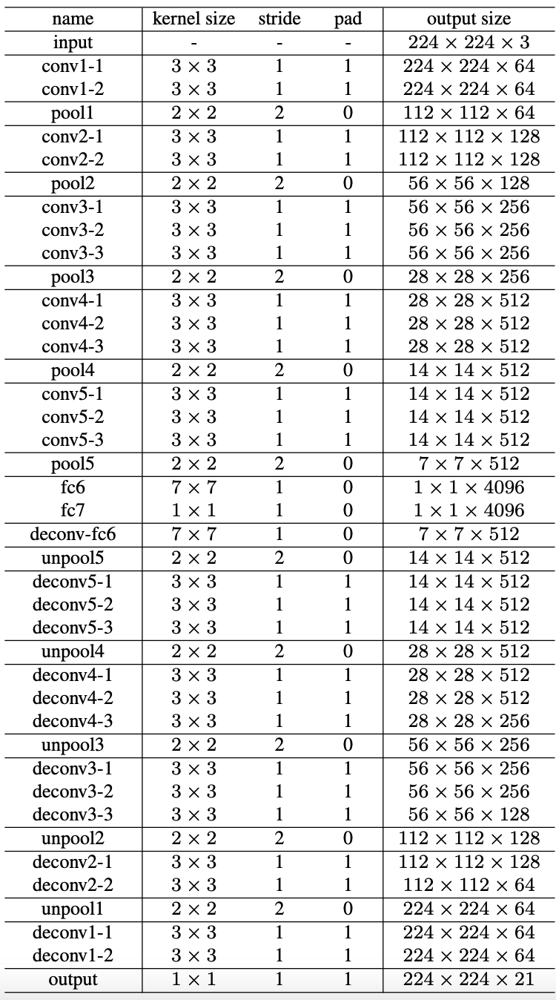

# DeconvNet Implementation with Pytorch

## 0. Develop Environment

## 1. Explain about Implementation

## 2. Brief Summary of *'Learning Deconvolution Network for Semantic Segmentation'*

### 2.1. Goal
- Improve FCN model with overcoming limitations of FCN

### 2.2. Intuition
- Deep deconvolution network : unpooling + deconvolution
  * unpooling captures example-specific structures
  * deconvolution captures class-specific shapes
- Instance-wise training : handle object in various scales effectively

### 2.3. Evaluation Metric
- Mean intersection over union

### 2.4. Network Architecture

- Convolution network : VGG16 with batchnorm (remove dropout, last fc layer)
- Deconvolution network : symmetric as convolution network (replace pool, conv to unpool, deconv)

### 2.5. Train and Inference on PASCAL VOC 2012
#### 2.5.1. Train
- 2-stage training
  * learn easy samples first : draw bounding box of instance and extend 1.2 times larger that instance can be in center (other instances are regard as background)
  * learn hard samples next : get bounding box using [Edge Boxes](https://pdollar.github.io/files/papers/ZitnickDollarECCV14edgeBoxes.pdf) and extend 1.2 times larger
- Data pre-processing
  * resize : (250, 250)
  * random crop : (224, 224)
  * random horizontal flip
- Objective : per-pixel multinomial logistic loss
- Train Details
  * minibatch SGD with momentum
    * batch size : 64
    * learning rate : 0.01
    * momentum : 0.9
    * weight decay : 0.0005

#### 2.5.2. Inference
- Data pre-processing
  * get 2000 object proposals using [Edge Boxes](https://pdollar.github.io/files/papers/ZitnickDollarECCV14edgeBoxes.pdf)
  * select top 50 proposals based on objectness scores
- Aggregate instance-wise segmentation maps
  * compute pixel-wise maximum to aggregate and make image prediction
- Ensemble
  * DeconvNet + FCN -> EDeconvNet (mean of class conditional probability maps)
  * EDeconvNet + CRF (state-of-the-art)

## 3. Reference Paper
- Learning Deconvolution Network for Semantic Segmentation [[paper]](https://arxiv.org/pdf/1505.04366.pdf)
- Original DeconvNet Implementation with Caffe [[github]](https://github.com/HyeonwooNoh/DeconvNet)
